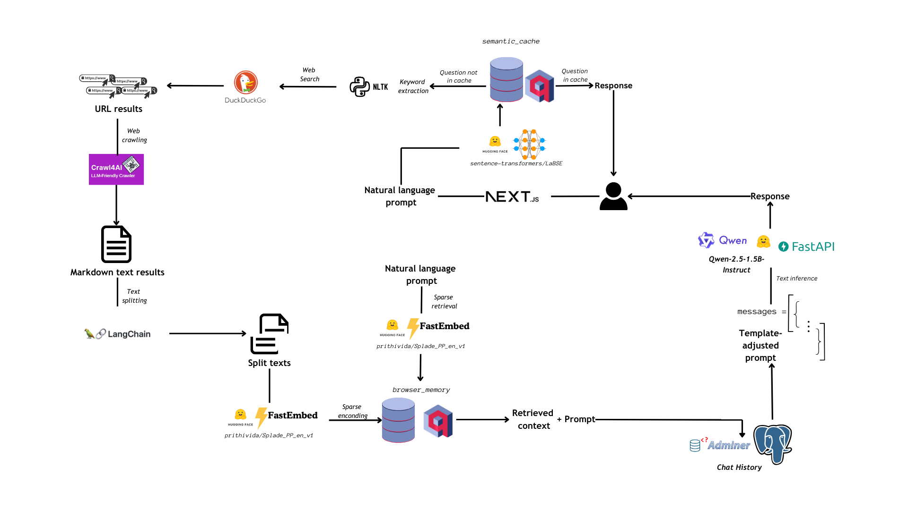

<h1 align="center">PrAIvateSearch</h1>
<h2 align="center">Own your AI, search the web with it🌐😎</h2>

<div align="center">
   <div>
        
   </div>
</div>


## About PrAIvateSearch

PrAIvateSearch is a NextJS web application that aims to implement similar features to SearchGPT, but in an open-source, local and private way. 

## Flowchart

<div align="center">
    
    <p><i>Flowchart for PrAIvateSearch</i></p>
</div>

The process of creating and the functioning of PrAIvateSearch is explained in [this blog post on HuggingFace](https://huggingface.co/blog/as-cle-bert/search-the-web-with-ai).

## Installation and usage

> [!IMPORTANT]
> _For this section, you should have [`conda`](https://docs.conda.io/projects/conda/en/latest/user-guide/getting-started.html) package manager, [`docker`](https://www.docker.com/) and [`docker compose`](https://docs.docker.com/compose/)._

1. Clone the repository:

```bash
git clone https://github.com/AstraBert/PrAIvateSearch.git
cd PrAIvateSearch
```

2. Move `.env.example` to `.env`...

```bash
mv .env.example .env
```

...and specify PostgreSQL related variables:

```bash
# .env file
pgql_db="postgres"
pgql_user="localhost"
pgql_psw="admin"
```

3. Install necessary dependencies with [`conda`](https://anaconda.org/anaconda/conda):

```bash
conda env create -f conda_environment.yaml
```

4. Set up Crawl4AI inside the `conda` environment:

```bash
conda activate praivatesearch
crawl4ai-setup
crawl4ai-doctor
conda deactivate
```

4. Start third-party services:

```bash
docker compose up -d
```

5. Run `Qwen-2.5-1.5B-Instruct` on API with FastAPI/Uvicorn:

```bash
conda activate praivatesearch
cd qwen-on-api/
uvicorn main:app --host 0.0.0.0 --port 8000
```

You can access the application from `http://localhost:3000` and chat with it!

### Usage note

> [!IMPORTANT]
> _The NextJS application was successfully developed and tested on a Ubuntu 22.04.3 machine, with 32GB RAM, 22 cores CPU and Nvidia GEFORCE RTX4050 GPU (6GB, cuda version 12.3), python version 3.11.11 (packaged by conda 24.11.0)_

Although being at a good stage of development, the application is a `beta` and might still contain bugs and have OS/hardware/python version incompatibilities.

## Contributions

Contributions are more than welcome! See [contribution guidelines](./CONTRIBUTING.md) for more information :)

## Funding

If you found this project useful, please consider to [fund it](https://github.com/sponsors/AstraBert) and make it grow: let's support open-source together!😊

## License and rights of usage

This project is provided under [MIT license](./LICENSE): it will always be open-source and free to use.

If you use this project, please cite the author: [Clelia (Astra) Bertelli](https://cleliasportfolio.xyz)


