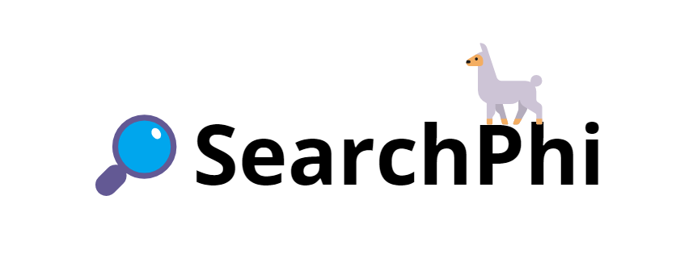

<h1 align="center">SearchPhi</h1>
<h2 align="center">Open source and AI-powered web search engine🌐</h2>


<div align="center">
    
   
   
   
   
   
   <div>
        
   </div>
</div>

## About SearchPhi

SearchPhi is a Streamlit application that aims to implement similar features to SearchGPT, but in an open-source, local and private way. 

## Installation and usage

### Source code

1. Clone the repository:

```bash
git clone https://github.com/AstraBert/SearchPhi.git
cd SearchPhi
```

2. Create a `model` folder, download [this GGUF file](https://huggingface.co/microsoft/Phi-3-mini-4k-instruct-gguf/blob/main/Phi-3-mini-4k-instruct-q4.gguf) and move the GGUF file in the `model` folder:

```bash
mkdir model
mv /path/to/Downloads/Phi-3-mini-4k-instruct-q4.gguf model/
```

3. Install necessary dependencies:
  - Linux:
```bash
python3 -m venv /path/to/SearchPhi
source /path/to/SearchPhi/bin/activate
python3 -m pip install -r requirements.txt
```
  - Windows Powershell:
```Powershell
python3 -m venv c:\path\to\SearchPhi
c:\path\to\SearchPhi\Scripts\Activate.ps1
python3 -m pip install -r requirements.txt
```


4. Run the application:

```bash
python3 -m streamlit run app.py
```

You'll see the application on `http://localhost:8501`.

**PROs**: You can customize the application code (change the GGUF model, change CPU/GPU settings, change generation kwargs, modify the app interface...)

**CONs**: Longer and more complex installation process

### Docker

1. Pull the image

```bash
docker pull astrabert/searchphi
```

2. Run the container:

```bash
docker run -p 8501:8501 astrabert/searchphi
```

Shortly after you submit the `docker run` command, the container logs will tell you that the application is up and running on `http://localhost:8501`.

**PROs**: Shorter and simpler installation process

**CONs**: You cannot customize the application code

### Usage note

> ⚠️ _The Streamlit application was successfully developed and tested on a Windows 10.0.22631 machine, with 32GB RAM, 16 core CPU and Nvidia GEFORCE RTX4050 GPU (6GB, cuda version 12.3), python version 3.11.9_

> ⚠️ _The Docker container was successfully tested on a Windows 10.0.22631 machine and on a Ubuntu 22.04.3 machine_ 

Although being at a good stage of development, the application is a `beta` and might still contain bugs and have OS/hardware/python version incompatibilities.

## Demo

You can try out SearchPhi on [this HuggingFace Space](https://huggingface.co/spaces/as-cle-bert/SearchPhi). 

Here's a video demo of what it can do:


## Contributions

Contributions are more than welcome! See [contribution guidelines](./CONTRIBUTING) for more information :)

## Funding

If you found this project useful, please consider to [fund it](https://github.com/sponsors/AstraBert) and make it grow: let's support open-source together!😊

## License and rights of usage

This project is provided under [MIT license](./LICENSE): it will always be open-source and free to use.

If you use this project, please cite the author: [Astra Clelia Bertelli](https://astrabert.vercel.app)


